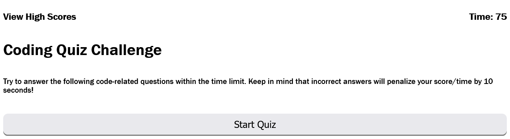

# Timed Coding Quiz

The aim of this project was to create a timed quiz on JavaScipt fundamentals that stores high scores upon quiz completion.

## Technologies Used
* JavaScript
* CSS
* HTML

with a focus on JavaScript DOM elements

---

---

## The following is a link to the live website.
https://p-fassbender.github.io/code-quiz/